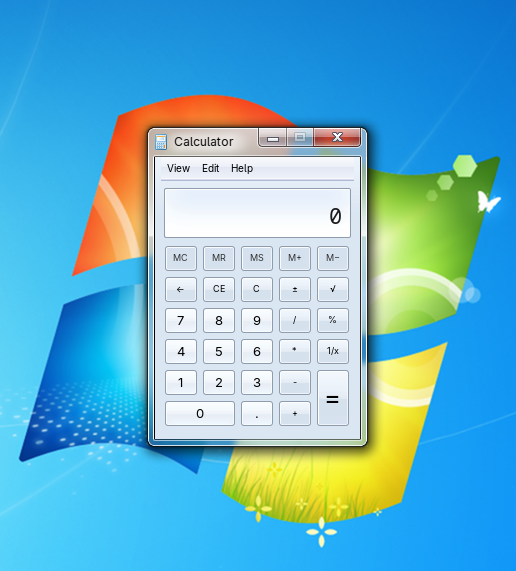

<h1>Microsoft® Windows™ is a registered trademark of Microsoft® Corporation. This name is used for referential use only, and does not aim to usurp copyrights from Microsoft. Microsoft Ⓒ 2025 All rights reserved. All resources belong to Microsoft Corporation.</h1>
# win7calc
kind of looks like the windows 7's calculator.
<h1> How to install it</h1>
run <code> git clone https://github.com/danr23/win7calc.git && cd win7calc/win7-calc-gtk3</code>
then to compile it run <code> meson setup buildir && meson compile -C builddir</code> (you can replace builddir with a name of your build directory)
and then run <code> sudo ln -sf ~/win7calc/win7-calc-gtk3/builddir/win7calc /usr/local/bin/win7calc && sudo cp ~/win7calc/win7-calc-gtk3/desktop/win7calc.desktop /usr/share/applications/</code> to make it appear in the start menu.
Then, run <code>cp -r win7calc/win7-calc-gtk3/data ~</code> to copy the css stylesheet to the home directory because for some reason, when you run the program without the stylesheet directory being in your home folder, the stylesheet does not load.
<h2>Screenshots</h2>

<h2>How to make it look more like windows 7's calculator</h2>
To change the look of the menubar in the calculator, install the <a href="https://store.kde.org/p/1012735/">Aero GTK3 Theme</a>
